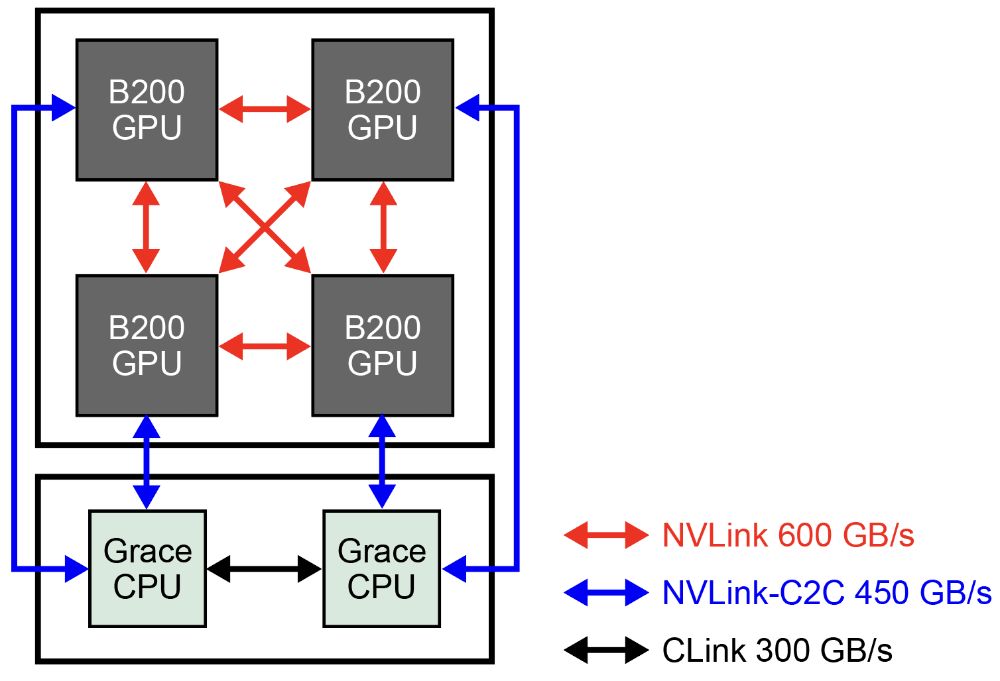
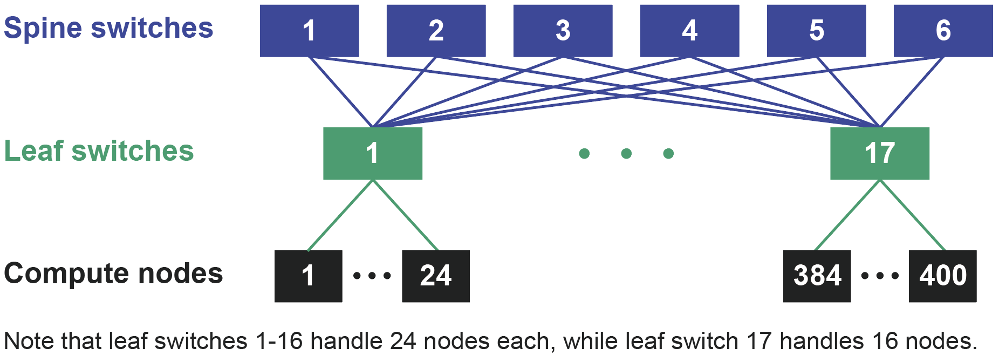

# System Overview

This system consists of 400 compute nodes equipped with NVIDIA GB200 NVL4, shared storage composed of 2 PB of high-speed storage (SSD) and 10 PB of large-capacity storage (HDD), and an InfiniBand XDR network that connects them at high speed. It is also connected to the Internet at 400 Gbps through the SINET6 academic information network.

## Compute Node Performance

| Item | Value |
|------|------|
| CPU/GPU model | NVIDIA GB200 NVL4 (Grace CPU &times; 2, B200 GPU &times; 4) |
| GPU theoretical performance (FP64) | 160.4 TFLOPS (40.1 TFLOPS &times; 4 GPU) |
| GPU theoretical performance (FP8) | 38.84 PFLOPS (9.712 PFLOPS &times; 4 GPU) |
| CPU memory performance | LPDDR5X, 960 GiB, 768 GB/s (480 GiB, 384 GB/s &times; 2 CPU) |
| GPU memory performance | HBM3e, 692.8 GiB, 31.6 TB/s (173.2 GiB, 7.9 TB/s &times; 4 GPU) |
| GPU-GPU bandwidth (bidirectional) | NVLink, 600 GB/s (300 GB/s &times; 2 (bidirectional)) |
| CPU-GPU bandwidth (bidirectional) | NVLink-C2C, 450 GB/s (225 GB/s &times; 2 (bidirectional)) |
| CPU-CPU bandwidth (bidirectional) | CLink, 300 GB/s (150 GB/s &times; 2 (bidirectional)) |
| Network | InfiniBand XDR, 800 Gbps &times; 4 |
| Local storage | Kioxia XD7P NVMe SSD 7.68 TB, bandwidth: Read 7.2 GB/s, Write 4.8 GB/s, IOPS (4 KB): Read 1,550 K, Write 200 K |

For details on CPU/GPU connections and bandwidth, see the following figure.

{ width="550" }

## Overall System Performance

| Item | Value |
|------|------|
| Number of compute nodes | 400 nodes |
| GPU theoretical performance (FP64) | 64.160 PFLOPS (160.4 TFLOPS &times; 400 nodes) |
| GPU theoretical performance (FP8) | 15.539 EFLOPS (38.84 PFLOPS &times; 400 nodes) |
| GPU memory performance | 270.625 TiB, 12.640 PB/s (692.8 GiB, 31.60 TB/s &times; 400 nodes) |
| CPU memory performance | 375 TiB, 307.2 TB/s (960 GiB, 768 GB/s &times; 400 nodes) |
| Shared storage | High-speed storage 2 PB (SSD), large-capacity storage 10 PB (HDD) |

## Network Topology

The network is a two-layer Fat Tree composed of 6 Spine switches and 17 Leaf switches. Of the 17 Leaf switches, 16 are connected to 24 compute nodes each, and the remaining Leaf switch is connected to 16 compute nodes (16 &times; 24 nodes + 1 &times; 16 nodes = 400 nodes). Communication between compute nodes under the same Leaf switch is fast, but communication that crosses Spine switches may experience somewhat lower performance depending on the communication path and the amount of simultaneous traffic.

{ width="700" }

<!-- The bisection bandwidth of all compute nodes is 326.4 Tbps (48 Spine switch downlink ports &times; 17 switches &times; 800 Gbps / 2). In contrast, the total injection bandwidth of the compute nodes is 1,280 Tbps (400 nodes &times; 800 Gbps &times; 4). Therefore, the bisection bandwidth is 25.5% of the total injection bandwidth (326.4 / 1,280 = 0.255). -->
