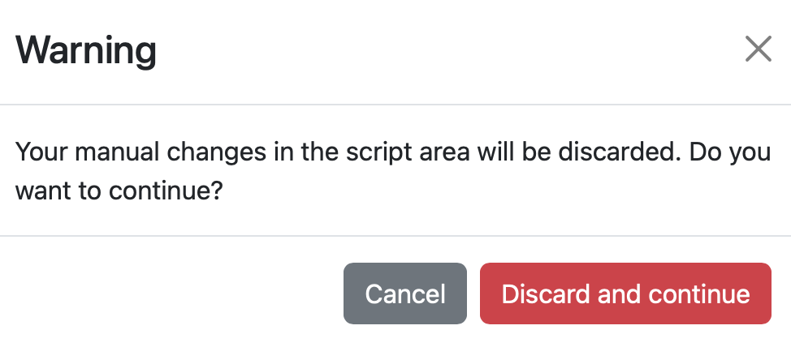
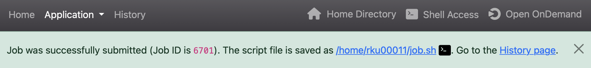
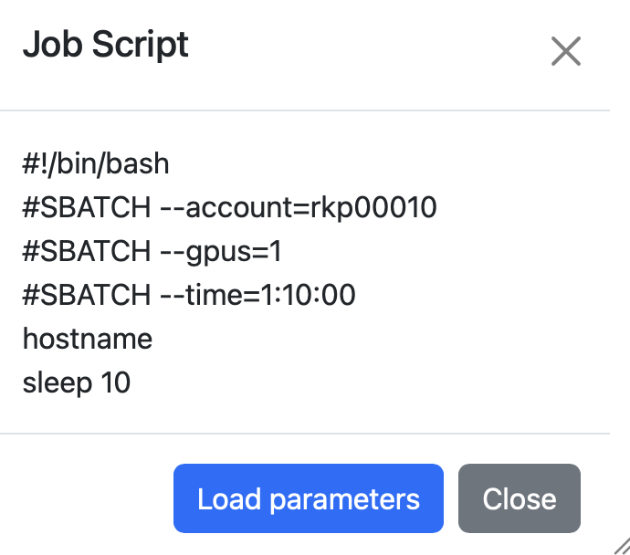

# Open Composer

Open Composer is an application that runs on Open OnDemand and lets you create and submit batch jobs. A batch job is a computational task that is executed non-interactively by the job scheduler and is described in a shell script. Compute resources are specified using job scheduler directives (for example, `#SBATCH --gpus=4`).

## Creating a Job Script

Select Slurm from the Open OnDemand dashboard.

When you enter values in the web form with a white background, a job script is generated in the text area at the bottom right. Note that the web form with a yellow background contains items that do not affect the job script. An asterisk on a web form label indicates a required item.

{ width="800" }

The items at the top right have the following meanings.

| Item            | Description                          |
| --------------- | ------------------------------------ |
| Script location | Directory where the job script is saved |
| Script name     | File name of the job script          |
| Job name        | Job name                             |

!!! note

    If you change the web form with a white background after manually editing the text area, the following warning appears. Clicking Discard and continue discards the changes you made in the text area.

    

## Submitting a Job

Click Submit at the bottom of the text area to submit the job. On success, the path of the save location and a link to the History Page are displayed. Clicking the path of the save location opens the [Open OnDemand Home Directory](ood.md#home-directory). Clicking the terminal icon next to the path opens [Open OnDemand RIKYU Shell Access](ood.md#rikyu-shell-access).

{ width="800" }

## Viewing Job History

You can view the history of submitted jobs.

* The search box at the top right lets you find a specific job by filtering the job history by conditions. Clicking the Detail button enables searching with more detailed conditions.
* Clicking &#9650; or &#9660; in the table header sorts the entire table in ascending or descending order using that column as the key. The default is descending order by Job ID.
* Clicking the link in the Job ID column displays detailed information about the job.

* Clicking the link in the Application column opens the page for the corresponding application.
* Clicking the link in the Script Location column opens the [Open OnDemand Home Directory](ood.md#home-directory). Clicking the terminal icon opens [Open OnDemand RIKYU Shell Access](ood.md#rikyu-shell-access).
* Clicking the link in the Script Name column displays the job script that was executed.

   

* Clicking Load parameters opens the application page with the parameters that were used to create that job script loaded.

* Select the target jobs using the checkboxes on the left side of the table and click Cancel Job to cancel queued or running jobs.
* Clicking Delete Info removes information about completed jobs from the table.
* Selecting the checkbox at the top of the table selects all jobs displayed on that page.
