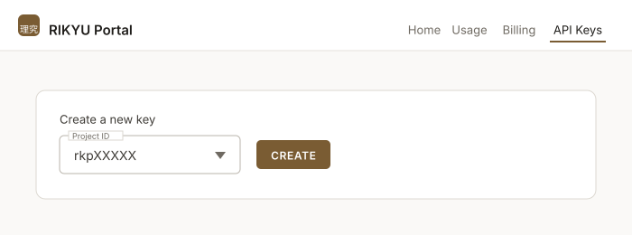

# Generative AI Service

This system provides a generative AI service based on large language models (LLMs). The API is OpenAI-compatible, so you can use it from your own machine or applications by simply switching the base URL of the OpenAI SDK or a compatible tool.

| Item              | Value                                  |
| ----------------- | -------------------------------------- |
| Endpoint (base URL) | `https://api.rikyu.r-ccs.riken.jp/v1` |
| API format        | OpenAI-compatible                      |
| Authentication    | API key (created in the RIKYU Portal)  |

## Available Models

| Model         | Parameters | Context length | Description                                    | Model card |
| ------------- | ---------- | -------------- | ---------------------------------------------- | ---------- |
| `qwen3.6-35b` | 35B        | 256K           | Standard model. Fast responses for general use | [Qwen/Qwen3.6-35B-A3B](https://huggingface.co/Qwen/Qwen3.6-35B-A3B){ target="_blank" rel="noopener" } |
| `kimi-k2.6`   | 1T         | 128K           | Large-scale model                              | [moonshotai/Kimi-K2.6](https://huggingface.co/moonshotai/Kimi-K2.6){ target="_blank" rel="noopener" } |
| `glm-5.2`     | 743B       | 1M             | Model for long contexts                        | [zai-org/GLM-5.2](https://huggingface.co/zai-org/GLM-5.2){ target="_blank" rel="noopener" } |
| `kimi-k3`     | 2.8T       | 928K           | Largest model                                  | [moonshotai/Kimi-K3](https://huggingface.co/moonshotai/Kimi-K3){ target="_blank" rel="noopener" } |

Parameters are total parameter counts. All of these are MoE (Mixture of Experts) models, so the number of parameters actually used to generate a token is smaller. Context length is the maximum number of input tokens accepted by this service, which may differ from the model's native limit.

All models support reasoning and function calling.

!!! note

    Models may be added or changed. You can retrieve the current list from `/v1/models` with your API key. See "Using curl" below for how to do this.

## Creating an API Key

Create an API key in the RIKYU Portal.

[RIKYU Portal](https://portal.rikyu.r-ccs.riken.jp/en/){ .md-button .md-button--primary .action-button target="_blank" rel="noopener" }

Log in to the portal and select <span class="text-marker">API Keys</span> at the top of the page. In the <span class="text-marker">Create a new key</span> form, choose a project ID and click <span class="text-marker">CREATE</span>.



!!! warning

    The key is shown only once, right after it is created. It cannot be retrieved again, so save it somewhere safe. If you lose it, revoke that key from the list and create a new one.

One key can be created per project. API usage is billed to the project the key was created for. If you belong to multiple projects, use the key for the project you want to use.

!!! warning

    An API key is a credential for using this system. Do not share it with others, and do not write it directly in source code or public repositories. If there is any risk of leakage, revoke the key from the list in the portal and create a new one.

## Using curl

Set your API key in an environment variable. `OPENAI_API_KEY` is the variable name that the OpenAI SDK and many compatible tools read by default.

```bash
export OPENAI_API_KEY=API_KEY
```

Retrieve the list of available models.

```bash
curl https://api.rikyu.r-ccs.riken.jp/v1/models \
    -H "Authorization: Bearer $OPENAI_API_KEY"
```

Generate text. Specify the model you want to use in `model`.

```bash
curl https://api.rikyu.r-ccs.riken.jp/v1/chat/completions \
    -H "Authorization: Bearer $OPENAI_API_KEY" \
    -H "Content-Type: application/json" \
    -d '{
      "model": "qwen3.6-35b",
      "messages": [
        {"role": "user", "content": "What is a supercomputer?"}
      ]
    }'
```

To receive the generated text incrementally, set `stream` to `true`.

```bash
curl https://api.rikyu.r-ccs.riken.jp/v1/chat/completions \
    -H "Authorization: Bearer $OPENAI_API_KEY" \
    -H "Content-Type: application/json" \
    -d '{
      "model": "qwen3.6-35b",
      "messages": [
        {"role": "user", "content": "What is a supercomputer?"}
      ],
      "stream": true
    }'
```

## Using Python

Install the OpenAI Python library.

```bash
pip install openai
```

Specify the endpoint in `base_url` and your API key in `api_key`.

```python
import os
from openai import OpenAI

client = OpenAI(
    base_url="https://api.rikyu.r-ccs.riken.jp/v1",
    api_key=os.environ["OPENAI_API_KEY"],
)

response = client.chat.completions.create(
    model="qwen3.6-35b",
    messages=[
        {"role": "user", "content": "What is a supercomputer?"},
    ],
)

print(response.choices[0].message.content)
```

To receive the generated text incrementally, specify `stream=True`.

```python
stream = client.chat.completions.create(
    model="qwen3.6-35b",
    messages=[
        {"role": "user", "content": "What is a supercomputer?"},
    ],
    stream=True,
)

for chunk in stream:
    content = chunk.choices[0].delta.content
    if content:
        print(content, end="", flush=True)
```

!!! note

    The models in this service are reasoning models. The reasoning that leads to the answer is stored in `message.reasoning_content`, not in `message.content`.

## Using OpenAI-Compatible Applications

Any application that lets you configure the base URL and an API key, such as Cline (a Visual Studio Code extension), works as is. Configure it as follows.

| Setting      | Value                                     |
| ------------ | ----------------------------------------- |
| API Provider | OpenAI Compatible                         |
| Base URL     | `https://api.rikyu.r-ccs.riken.jp/v1`     |
| API Key      | Your API key                              |
| Model ID     | The model to use (for example, `qwen3.6-35b`) |

The names of the settings differ between applications, but any application that lets you configure the base URL, an API key, and a model name can be used in the same way.

## Notes

- If you do not specify `max_tokens`, the maximum number of tokens generated per request is 32,768. When you send a long input, adjust `max_tokens` so that the input plus `max_tokens` does not exceed the context length of the model. Exceeding it results in an error (HTTP 400).
- The maximum request body size is 32 MB.
- The request timeout is 600 seconds.
- Only paths under `/v1` are publicly available.

## Usage Fees

The generative AI service is free of charge during Early Access Phase 2.

The usage fee described in [Welcome](index.md) (300 JPY per GPU hour) applies to compute jobs run with Slurm; the generative AI service is not subject to it. You can check your API usage on the usage page of the RIKYU Portal.
