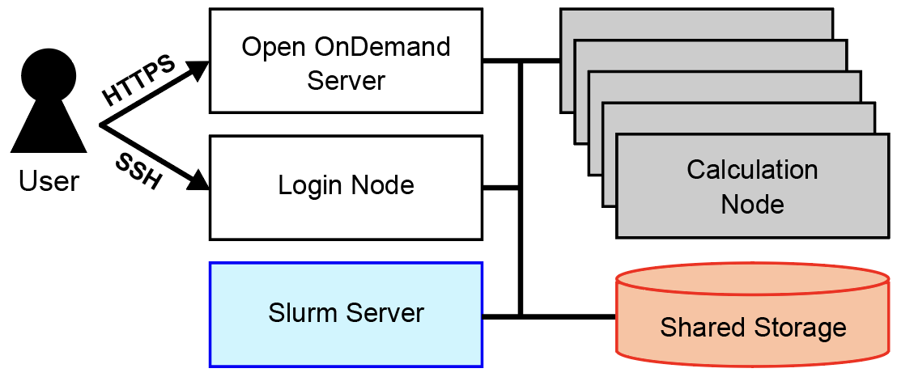
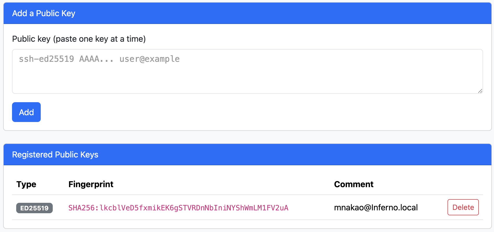

# Login

This system provides two login methods: <span class="text-marker">connecting to the Open OnDemand server over HTTPS from a web browser</span> and <span class="text-marker">connecting to a login node over SSH from terminal software</span>. After logging in with either method, submit jobs to compute nodes through the [Slurm job scheduler](https://slurm.schedmd.com/slurm.html){ target="_blank" rel="noopener" }. Place data on shared storage for use.

{ width="500" }

## Open OnDemand

Open OnDemand is a web portal that lets you use the supercomputer from a web browser. Log in to Open OnDemand from the link below.

[Open OnDemand](https://ondemand.rikyu.r-ccs.riken.jp){ .md-button .md-button--primary .action-button target="_blank" rel="noopener" }

For details, see [Open OnDemand](ood.md).

## Terminal Software

### Creating a Key Pair (Private Key and Public Key)

!!! note

    If you have not generated a key pair yet, use this section as a reference to generate one.

Before connecting over SSH from terminal software, create a key pair consisting of a private key and a public key. We recommend generating one of the following types of key pairs.

* Ed25519
* ECDSA (NIST P 521)
* RSA (key length of 2048 bits or more)

This section explains how to generate a key pair from a terminal.

* On Windows, start PowerShell.
* On macOS, start Terminal (Applications &#x25BB; Utilities &#x25BB; Terminal).
* On Linux, start a terminal emulator.

The following example shows the `ssh-keygen` command for generating an Ed25519 key pair (on Windows, use the `ssh-keygen.exe` command). After running the command, a private key (`id_ed25519`) and a public key (`id_ed25519.pub`) are created as a key pair in the `.ssh` directory under your home directory.

```bash
$ ssh-keygen -t ed25519
Generating public/private ed25519 key pair.
Enter file in which to save the key (/home/username/.ssh/id_ed25519):
Enter passphrase (empty for no passphrase):  # Enter a passphrase
Enter same passphrase again:                 # Enter the same passphrase again
Your identification has been saved in /home/username/.ssh/id_ed25519.
Your public key has been saved in /home/username/.ssh/id_ed25519.pub.
The key fingerprint is:
SHA256:dlah2Qrf131ccOS5Fs/IFbrkd8LLWMHxPI393AMagag username@hostname
The key's randomart image is:
+--[ED25519 256]--+
|        . ... ooo|
|       . . +.o.X+|
|      . . o.o+++O|
|     E   o +=ooOX|
|        S =..oB=%|
|       . o   =oo+|
|            . o  |
|                 |
|                 |
+----[SHA256]-----+
```

!!! note

    Be sure to set a passphrase. Use a string that is difficult for others to guess (15 or more characters are recommended).

### Registering an SSH Public Key

Register your SSH public key with this system from Open OnDemand. Log in to Open OnDemand from the link below.

[Open OnDemand](https://ondemand.rikyu.r-ccs.riken.jp){ .md-button .md-button--primary .action-button target="_blank" rel="noopener" }

Launch "SSH Public Key". The following screen appears. Enter your SSH public key in the text area under "Add a Public Key", then click the "Add" button. When registration succeeds, the registration information appears under "Registered Public Keys".

{ width="800" }

After registering your public key, you can log in over SSH from terminal software with the following command. Replace `USERNAME` with your user name.

```bash
$ ssh USERNAME@login.rikyu.r-ccs.riken.jp
```

For information on submitting jobs from the command line, see [Slurm](slurm.md).
