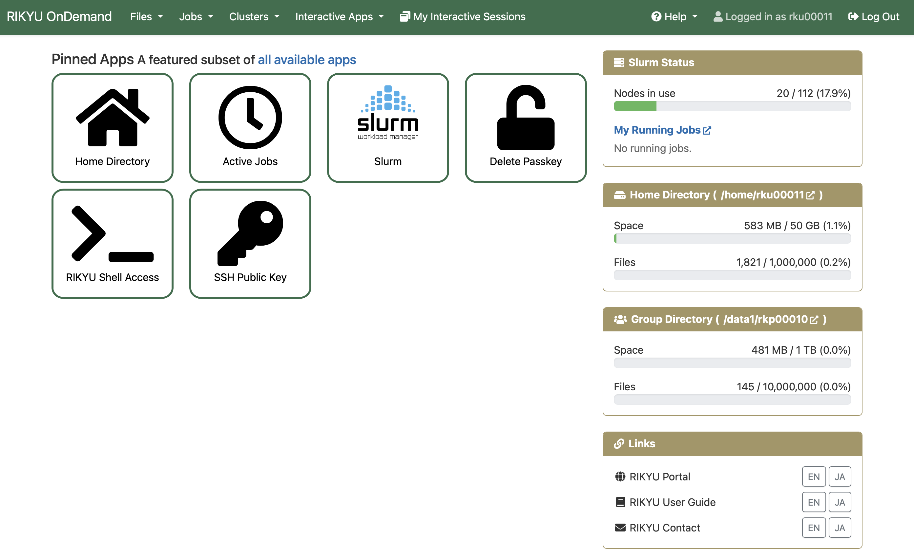
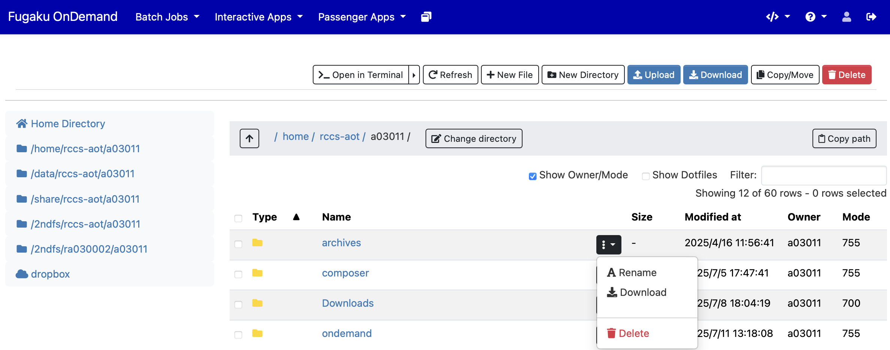
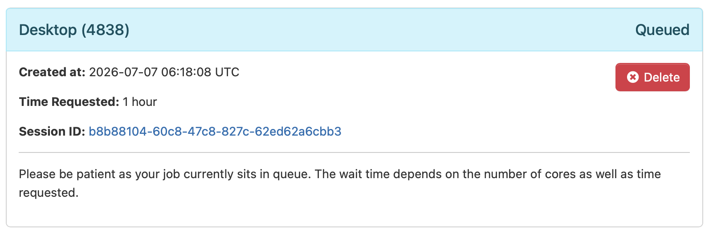
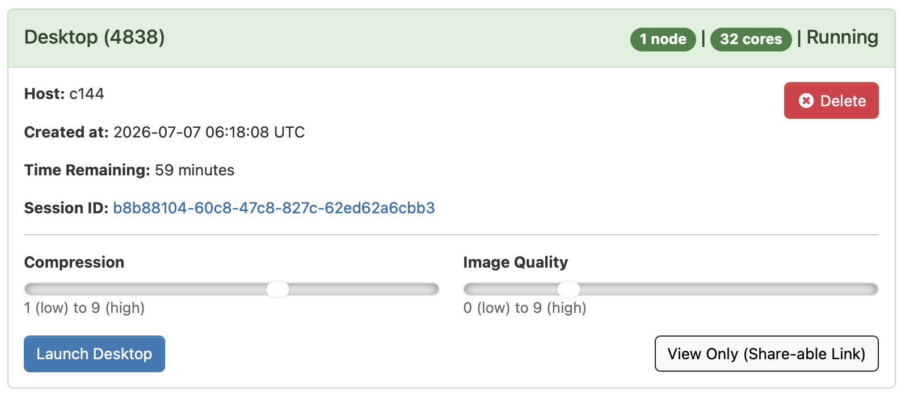
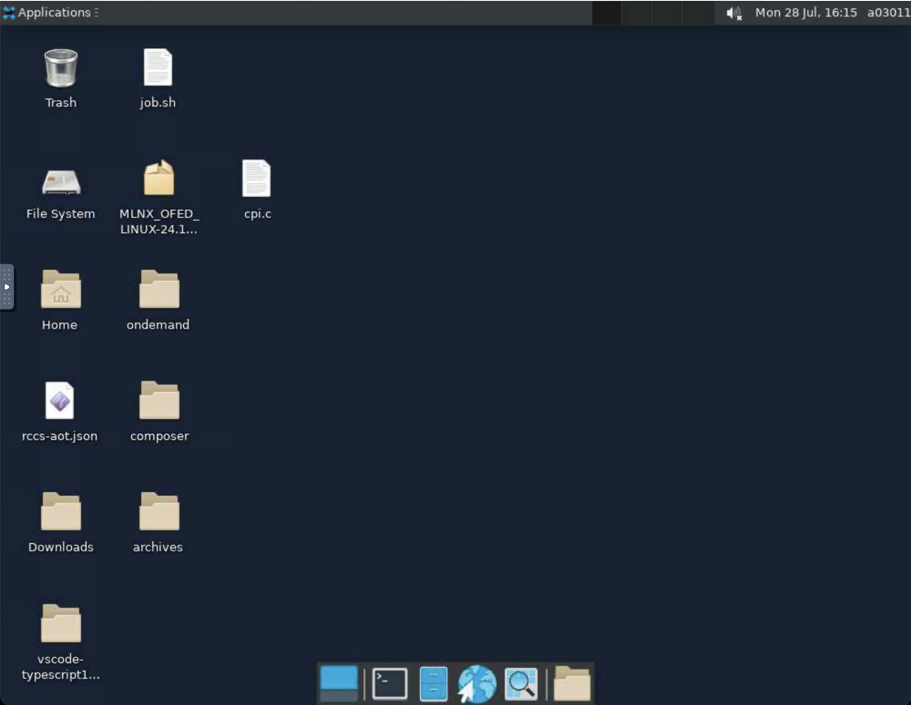

# Open OnDemand

Open OnDemand is a web portal that lets you use the supercomputer from a web browser. Log in to Open OnDemand from the link below.

[Open OnDemand](https://ondemand.rikyu.r-ccs.riken.jp){ .md-button .md-button--primary .action-button target="_blank" rel="noopener" }

Open OnDemand provides the following features.

* File transfer and editing
* Job submission and management
* Web terminal access
* Running interactive applications, such as remote desktops

!!! note

    Open OnDemand supports major web browsers such as Google Chrome, Mozilla Firefox, and Microsoft Edge, but Internet Explorer 11 is not supported. Chrome is recommended because it natively supports copying and pasting text in remote desktop sessions and similar environments.

The following figure shows the Open OnDemand dashboard for RIKYU.

The menu bar at the top of the screen contains the following items.

| Item                           | Description                                      |
| ------------------------------ | ------------------------------------------------ |
| Files                          | File transfer and editing                        |
| Jobs                           | Job submission and management                    |
| Clusters                       | Cluster operations, such as web terminal access  |
| Interactive Apps               | Running interactive applications, such as remote desktops |
| My Interactive Sessions        | List of interactive application sessions         |
| Help &rarr; Restart Web Server | Restart Open OnDemand                            |
| Log Out                        | Log out of Open OnDemand                         |

!!! note

    Some menu items may be displayed as icons when the browser window is narrow.

## File Transfer and Editing

| Name           | Description               |
| -------------- | ------------------------- |
| Home Directory | File transfer and editing |

### Home Directory

You can transfer, edit, and manage files. The maximum transfer size is 10 GB.

The functions in Home Directory are as follows. To perform operations on individual files or directories, use the three-dot menu with the downward triangle.

| Toolbar          | Description                     |
| ---------------- | ------------------------------- |
| Open in Terminal | Open a web terminal             |
| Refresh          | Refresh the page                |
| New File         | Create a new file               |
| New Directory    | Create a new directory          |
| Upload           | Upload files                    |
| Download         | Download files                  |
| Copy/Move        | Copy or move files              |
| Delete           | Delete directories or files     |

| Path Bar        | Description                            |
| --------------- | -------------------------------------- |
| &uarr;          | Move to the parent directory           |
| Change directory | Change directory                       |
| Copy path       | Copy the current path to the clipboard |

| Display Option  | Description                 |
| --------------- | --------------------------- |
| Show Owner/Mode | Show owner and permissions  |
| Show Dotfiles   | Show dotfiles               |
| Filter          | Filter by file name         |

## Job Submission and Management

| Name                    | Description                         |
| ----------------------- | ----------------------------------- |
| Active Jobs             | Job monitoring                      |
| Slurm                   | Batch job creation and submission   |

### Active Jobs

You can view and delete job information. Click the button on the left side of the ID column to show detailed job information. Click the button in the Actions column to delete a job.

### Slurm

See [Open Composer](composer.md).

## Cluster Operations

| Name                     | Description                  |
| ------------------------ | ---------------------------- |
| Delete Passkey           | Delete passkeys              |
| RIKYU Shell Access       | Web terminal                 |
| SSH Public Key           | SSH public key registration  |

### RIKYU Shell Access

You can access a login node over SSH from a web browser and use a command-line interface.

### SSH Public Key

See [SSH Public Key Registration](https://docs.r-ccs.riken.jp/rikyu/en/login/#ssh).

### Delete Passkey

You can delete registered passkeys. Click the "Delete" button.

## Interactive Applications

Interactive applications let users interactively operate applications running on compute nodes.

| Name                                                      | Description                                                                        |
| --------------------------------------------------------- | ---------------------------------------------------------------------------------- |
| Desktop ([Xfce](https://www.xfce.org/))                   | Lightweight desktop environment running on X Window System                         |
| [JupyterLab](https://jupyter.org/) (planned)              | Interactive programming environment in a web browser                               |
| Terminal ([ttyd](https://github.com/OpenOnDemandJP/ttyd)) | Tool for operating terminal sessions from a web browser                            |
| [VSCode](https://code.visualstudio.com/)                  | Code editor developed by [Microsoft](https://www.microsoft.com/)                   |
| NVIDIA Profiler                                           | [NVIDIA Nsight Compute](https://developer.nvidia.com/nsight-compute) and [NVIDIA Nsight Systems](https://developer.nvidia.com/nsight-systems) |
| [Gnuplot](http://www.gnuplot.info/)                       | Command-line driven graphing program                                               |
| [OVITO](https://www.ovito.org)                            | Scientific data visualization and analysis solution for particle-based simulations |
| [ParaView](https://www.paraview.org/)                     | Scientific and technical data visualization program                                |
| [PyMOL](https://www.pymol.org/)                           | Program for visualizing and analyzing 3D structures of biomolecules                |

The following example explains how to use Desktop. Click Desktop from Interactive Apps in the menu bar to open a web form for specifying compute resources and other settings. After entering the required information, click Launch to submit a job to RIKYU.

Immediately after submitting the job, Queued is displayed in the upper right of the screen. This indicates that the job is waiting to run.

When the job starts on a compute node, the status changes to Running, and the Launch Desktop button appears. Set Compression and Image Quality as needed, then click Launch Desktop to display Desktop in the web browser.

!!! tip

    Click the View Only (Share-able Link) button to open a mirrored Desktop in a new tab. The mirrored screen cannot be operated. You can share the screen only with users who have a RIKYU account by sending the URL of this tab by email or another method.

To terminate Desktop, use one of the following methods. Note that closing the web browser does not terminate the session.

* Click the Delete button on the Running screen.
* Click My Interactive Sessions in the menu bar, and then click the Delete button for the corresponding job.
* Click Applications in the upper left of Desktop, and then click Log Out.
