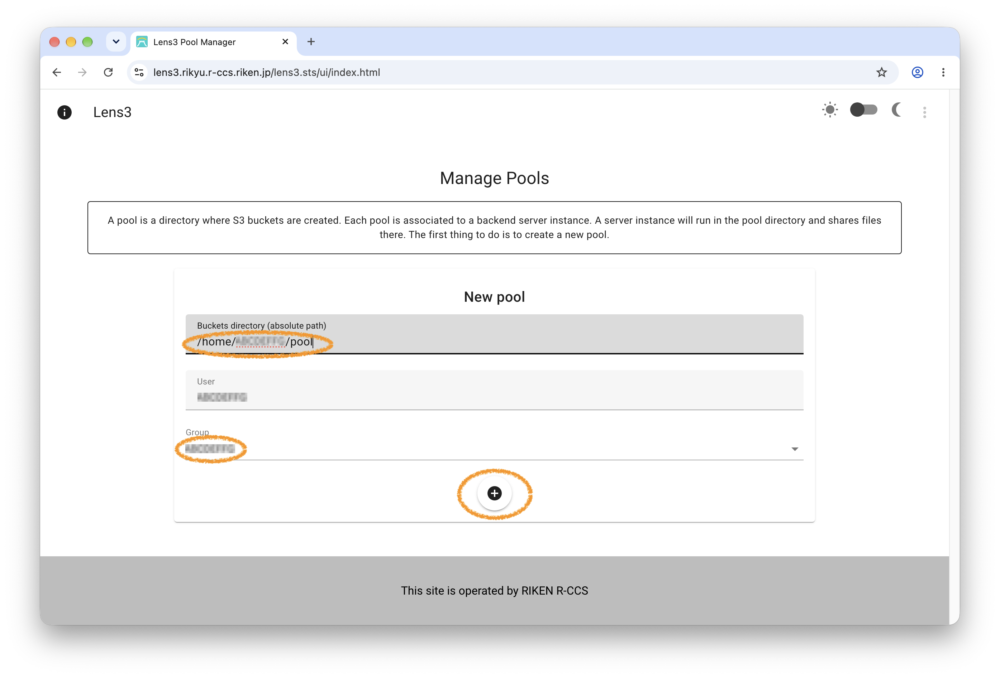
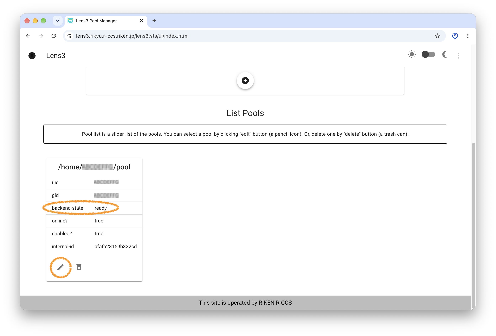

# S3 File System

## An Overview of the Service { #service }

AWS S3 service on Rikyu allows users to share files in home
directories via Amazon AWS S3 protocol.  This service, Lenticularis-S3
(Lens3), consists of two open-source software, Lens3 + Baby-server.

Lens3 does not provide S3 buckets operations, such as listing or
creating buckets, because S3 service will be activated when registered
buckets are accessed.  Thus, buckets need to be created in advance.
Registrar Web-UI is used to create buckets.

In Lens3's terminology, a *pool* refers to a directory in the
filesystem where buckets are created.  Users first create a pool, then
create buckets in it.

## Registering Buckets and Generating Access Keys { #buckets }

Lens3 Registrar can be accessed by the following URL, where users can
register a pool and create buckets and access keys.

[https://lens3.rikyu.r-ccs.riken.jp/lens3.sts/](https://lens3.rikyu.r-ccs.riken.jp/lens3.sts/)

The following sections describe the usage of Lens3 step by step.  The
first step is to create a pool.

### Creating Pools

*Manage Pools* section appears first when accessing Registrar Web-UI.
A pool is a directory to hold buckets.  Access keys are also
associated to a pool.

Fill a directory in a full path, select a unix group, then click the
create button (a plus icon).  The directory needs to be writable to the
user:group pair.



### Selecting a Pool

*List Pools* section displays a list of existing pools.  It is a
slider list.  Check the *backend-state* of the pool just created,
which should be *ready*.  A pool is unusable when it is in the
inoperable state (often, the reason is the directory is not writable).

Select a pool by clicking the edit button (a pencil icon).  It opens
Edit a Pool section.  Or, delete a pool by clicking the delete button
(a trash-can icon).



### Creating Buckets

*Edit a Pool* section has two independent subsections -- one for
buckets and the other for access keys.

A bucket has a bucket-policy that specifies a permission to public
access: **none**, **upload**, **download**, or **public**.  A bucket
with the none-policy is accessible only with access keys.

Bucket names are global, that is, they are shared by all users.
Please avoid short commonplace names.


### Generating Access Keys

An access key has a key-policy: **readwrite**, **readonly**, or
**writeonly**.  Accesses to buckets are restricted by these policies.
An expiration date must be a future.  An expiration date is actually a
time in second, but the UI only handles it by date at midnight UTC.


### Lens3 User Guide

The Lens3's page in github.com has a user guide which describes more
about Lens3.  Please refer to it.

[https://github.com/RIKEN-RCCS/lens3/blob/main/v2/doc/user-guide.md](https://github.com/RIKEN-RCCS/lens3/blob/main/v2/doc/user-guide.md)

## Accessing Buckets by AWS CLI { #awscli }

The access point (`endpoint_url`) of S3 service is:

    https://lens3.rikyu.r-ccs.riken.jp

There are many AWS S3 client software and choose one for your liking.
AWS CLI is a popular one.  We use AWS CLI in the following.

### AWS CLI Installation

An installation instruction of AWS CLI can be found in the following
page.

[Installing or updating to the latest version of the AWS CLI](https://docs.aws.amazon.com/cli/latest/userguide/getting-started-install.html)

The config file "~/.aws/config" may contain the following lines.  The
credentials can be created and copied in the Web-UI.  Usually, only
the lines of a pair of credentials (access keys) are suffice.  Note
the credentials can be stored in a separate file "~/.aws/credentials".

    [default]
    s3 =
        signature_version = s3v4
        addressing_style = path
    ec2_metadata_disabled = true
    endpoint_url = https://lens3.rikyu.r-ccs.riken.jp
    aws_access_key_id = XXXXXXXXXXXXXXXXXXXX
    aws_secret_access_key = XXXXXXXXXXXXXXXXXXXXXXXXXXXXXXXXXXXXXXXXXXXXXXXX

### S3 Operation -- Listing Files

Try a simple command:

```bash
aws s3 ls s3://some-bucket-name/
```

Replace *some-bucket-name* with an actual one, as usual.

Optionally `aws` command accepts an option
`--endpoint-url=https://lens3.rikyu.r-ccs.riken.jp` which replaces the
"endpoint_url" in "~/.aws/config".

### S3 Operation -- Uploading Files

Then, try a command:

```bash
aws s3 cp sample.txt s3://some-bucket-name/
```

### S3 Operation -- Downloading Files

Or, try another command:

```bash
aws s3 cp s3://some-bucket-name/sample.txt
```

!!! note

    Access keys have expiration.  The lifetime of access keys is
    limited to 180 days in the current setting.  It will fail to try
    to create a key with longer lifetime.

    The service is limited to 30 servers at a time (the number of
    pools simultaneously accessed).  We will relax this limitation
    when the service become busy.

## Software Components { #software }

- Lens3: Endpoint Multiplexer
    - [https://github.com/RIKEN-RCCS/lens3](https://github.com/RIKEN-RCCS/lens3)
- S3 Baby-server: Small AWS S3 Server
    - [https://github.com/RIKEN-RCCS/s3-baby-server](https://github.com/RIKEN-RCCS/s3-baby-server)
