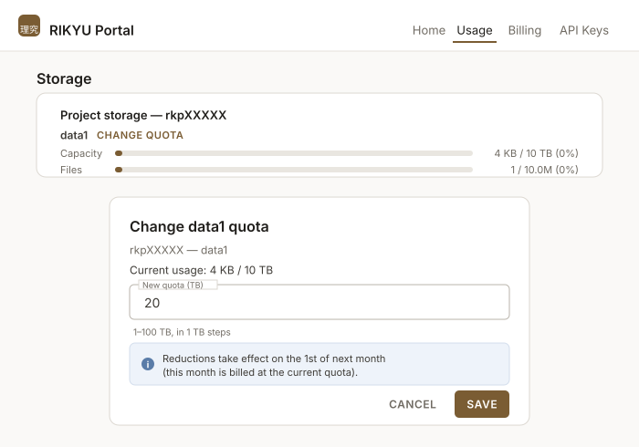

# Storage

The storage areas of this system are divided into three types: <span class="text-marker">home area</span>, <span class="text-marker">group area</span>, and <span class="text-marker">scratch area</span>. This page explains the characteristics of each area. Use them according to your purpose.

## Home Area

Each user has a 50 GB home area (`/home/USER`). `USER` is the user name. Only the user who owns the area can read and write to it. The home area is suitable for storing per-user configuration files and small work files.

To check home area usage from the command line, run the following command.

```bash
lfs quota -h -p `lfs project -d $HOME | awk '{print $1}'` /home
```

Example output:

```text
Disk quotas for prj 100010 (pid 100010):
Filesystem    used   bquota  blimit  bgrace   files   iquota  ilimit  igrace
     /home   2.42G       0k     50G       -     511        0 1000000       -
```

`used` is the used capacity, `blimit` is the capacity limit, `files` is the number of files in use, and `ilimit` is the file count limit.

## Group Area

Each group has a 1 TB group area (`/data1/GROUP`). `GROUP` is the group name. Members of the same group can read and write to the group area. The group area is suitable for storing large work files and data shared among members of the same group.

To check group area usage from the command line, run the following command (`GROUP` should be replaced with the group name).

```bash
lfs quota -h -p `lfs project -d /data1/GROUP | awk '{print $1}'` /data1
```

Example output:

```text
Disk quotas for prj 200013 (pid 200013):
Filesystem    used   bquota  blimit  bgrace   files   iquota  ilimit  igrace
    /data1      4k       0k      1T       -       1        0 10000000       -
```

`used` is the used capacity, `blimit` is the capacity limit, `files` is the number of files in use, and `ilimit` is the file count limit.

To find your group name from the command line, run the `id` command and check the string beginning with `rkp` shown in `groups=...`. An example is shown below. A single user may belong to multiple groups.

```bash
rku00011@c000:~$ id
uid=100010(rku00011) gid=200000(rkuser) groups=200000(rkuser),200013(rkp00010)
```

## Scratch Area

Each compute node has a scratch area (`/tmp`) backed by local SSDs. 1.5 TB is available per GPU. Only the user running the job can read and write to the scratch area. The scratch area is suitable when you want to handle intermediate results and similar data on fast local SSDs during computation.

Files in the scratch area are deleted when the job finishes. Copy any results that need to be preserved to the home area or group area before the job ends.

## Comparison of Storage Areas

The home area and group area are on shared storage, so they can be used from both compute nodes and login nodes. Data can also be shared among multiple compute nodes. The scratch area is a temporary area on the compute node where the job is running and can be used only by processes running on that node. The home area and group area use Lustre as their file system, and the scratch area uses xfs. The users who can read and write differ by area: only the user can access the home area and scratch area, while members of the same group can access the group area.

<div class="spec-table">
<table>
  <tbody>
    <tr>
      <th>Name</th>
      <th>Mount point</th>
      <th>Capacity</th>
      <th>Use from login nodes and<br>sharing among multiple nodes</th>
      <th>File system</th>
      <th>Users with read/write access</th>
    </tr>
    <tr>
      <td>Home area</td>
      <td><code>/home/USER</code></td>
      <td>50 GB</td>
      <td rowspan="2">Available</td>
      <td rowspan="2">Lustre</td>
      <td>Owner only</td>
    </tr>
    <tr>
      <td>Group area</td>
      <td><code>/data1/GROUP</code></td>
      <td>1 TB per group</td>
      <td>Members of the same group</td>
    </tr>
    <tr>
      <td>Scratch area</td>
      <td><code>/tmp</code></td>
      <td>1.5 TB per GPU</td>
      <td>Not available</td>
      <td>xfs</td>
      <td>Owner only</td>
    </tr>
  </tbody>
</table>
</div>

The home area uses 2 PB of high-speed storage (SSD), while the group area uses 10 PB of large-capacity storage (HDD). Note that the home area and group area therefore have different performance characteristics.

## Changing Capacity

### Group Area

The capacity of the group area can be changed in the RIKYU Portal by the project's principal investigator (PI) or sub-principal investigator (SubPI). It can be set in units of 1 TB, up to 100 TB.

[RIKYU Portal](https://portal.rikyu.r-ccs.riken.jp/en/usage/){ .md-button .md-button--primary .action-button target="_blank" rel="noopener" }

Sign in to the portal and select <span class="text-marker">Usage</span> at the top of the page. Under <span class="text-marker">Storage</span>, click <span class="text-marker">CHANGE QUOTA</span> for the project, enter a <span class="text-marker">New quota (TB)</span>, and click <span class="text-marker">SAVE</span>.



An increase takes about 5 to 10 minutes to take effect. A decrease takes effect on the first day of the following month. Each project can have one scheduled decrease at a time; setting another one replaces it, and setting the value back to the current capacity cancels it.

!!! note

    Only a PI or SubPI can change the capacity. Other project members can view the current usage and capacity.

!!! note

    The file count (inode) limit cannot be changed in the portal. If you need it changed, request it with a ticket.

If you need more than 100 TB, the PI or SubPI should request it with a ticket using the link below.

[Create a Ticket](https://support.r-ccs.riken.jp/hc/ja/requests/new){ .md-button .md-button--primary .action-button target="_blank" rel="noopener" }

### Home Area

The capacity of the home area cannot be changed. Store large data in the group area.

!!! note

    Charges based on the additional capacity are planned, but no charges will be incurred during Early Access Phase 2. The fees are currently under review.
