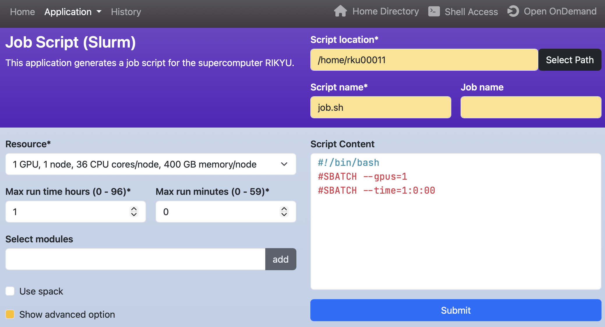
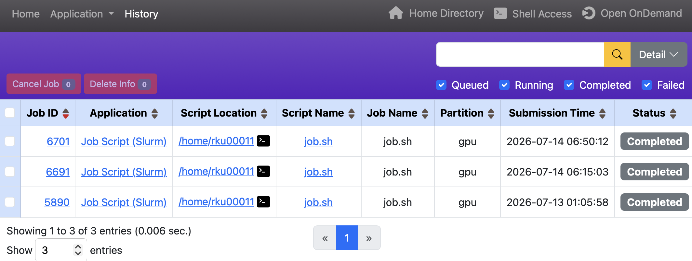
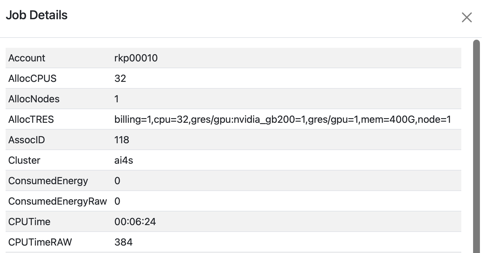

# Open Composerの使い方

Open Composerとは、Open OnDemand上で動作するアプリケーションであり、バッチジョブの作成・投入を行うことができます。バッチジョブとはジョブスケジューラによって非対話的に実行される計算タスクのことであり、シェルスクリプトで記述されます。計算資源はジョブスケジューラのディレクティブ（例：`#SBATCH --gpus=4`）で指定します。

## ジョブスクリプトの作成

Open OnDemandのダッシュボードからSlurmを選択します。

背景が白色のWebフォームに値を入力すると、右下のテキストエリアにジョブスクリプトが生成されます。なお、背景が黄色のWebフォームは、ジョブスクリプトに影響しない項目です。Webフォームのラベルにあるアスタリスクは必須項目を指します。
	
{ width="800" }

右上の項目の意味は下記の通りです。

| 項目            | 意味                                 |
| --------------- | ------------------------------------ |
| Script location | ジョブスクリプトの保存先ディレクトリ |
| Script name     | ジョブスクリプトのファイル名         |
| Job name        | ジョブ名                             |

!!! note

    テキストエリアを手動で編集した後に背景が白色のWebフォームを変更すると、下記の警告画面が表示されます。Discard and continueをクリックするとテキストエリアで編集した内容は破棄されます。
    
    

## ジョブの投入

テキストエリアの下部にあるSubmitをクリックするとジョブが投入されます。成功時には保存場所のパスとHistory Pageへのリンクが表示されます。保存場所のパスをクリックすると、[Open OnDemandのHome Directory](ood.md#home-directory)が起動します。保存場所のパスの横にあるターミナルのアイコンをクリックすると、[Open OnDemandのRIKYU Shell Access](ood.md#rikyu-shell-access)が起動します。

{ width="800" }

## ジョブ履歴の閲覧

投入したジョブの履歴を閲覧することができます。

* 右上の検索窓は、ジョブ履歴を条件で絞り込むことで、目的のジョブを検索するための機能です。Detailボタンをクリックすると、より詳細な条件での検索が可能です。
* テーブルのヘッダにある&#9650;と&#9660;をクリックすると、その列をキーとしてテーブル全体が昇順または降順に並び替えられます。デフォルトはJob IDの降順です。
* Job IDの項目のリンクをクリックすると、ジョブの詳細情報が表示されます。

* Applicationの項目のリンクをクリックすると、該当アプリケーションのページが開きます。
* Script Locationの項目のリンクをクリックすると、[Open OnDemandのHome Directory](ood.md#home-directory)が開きます。また、ターミナルアイコンをクリックすると、[Open OnDemandのRIKYU Shell Access](ood.md#rikyu-shell-access)が起動します。
* Script Nameの項目のリンクをクリックすると、実行したジョブスクリプトが表示されます。

   

* Load parametersをクリックすると、そのジョブスクリプトを作成するために用いられたパラメータがロードされた状態でアプリケーションページが開きます。
* テーブルの左側にあるチェックボックスで対象のジョブを選択し、Cancel Jobをクリックすると、キューに登録されているジョブもしくは実行中のジョブをキャンセルできます。
* Delete Infoをクリックすると、完了したジョブの情報をテーブルから削除できます。
* テーブルの一番上のチェックボックスをチェックすると、そのページに表示されているすべてのジョブを選択できます。
