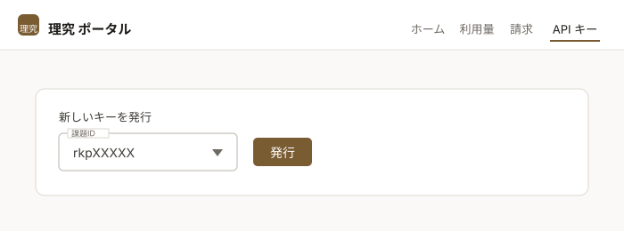

# 生成AIサービス

本システムでは、大規模言語モデル（LLM）による生成AIサービスを提供しています。APIはOpenAI互換であるため、OpenAI SDKや互換ツールの接続先を差し替えるだけで、お手元の端末やアプリケーションから利用できます。

| 項目                       | 値                                     |
| -------------------------- | -------------------------------------- |
| エンドポイント（base URL） | `https://api.rikyu.r-ccs.riken.jp/v1`  |
| API形式                    | OpenAI互換                             |
| 認証                       | APIキー（理究ポータルで発行）           |

## 利用できるモデル

| モデル名      | コンテキスト長 | 説明                                     |
| ------------- | -------------- | ---------------------------------------- |
| `qwen3.6-35b` | 256K           | 標準モデル。応答が速く、汎用的に利用できます |
| `kimi-k2.6`   | 128K           | 大規模モデル                             |
| `glm-5.2`     | 1M             | 長いコンテキストを扱えるモデル           |

いずれのモデルも、推論（reasoning）とFunction Callingに対応しています。

!!! note

    モデルは追加・変更されることがあります。最新の一覧は、発行したAPIキーを使って`/v1/models`から取得できます。取得方法は後述の「curlでの利用」を参照してください。

## APIキーの発行

APIキーは、理究ポータルで発行します。

[理究ポータル](https://portal.rikyu.r-ccs.riken.jp/ja/){ .md-button .md-button--primary .action-button target="_blank" rel="noopener" }

ポータルにログインし、画面上部の<span class="text-marker">API キー</span>を選択します。<span class="text-marker">新しいキーを発行</span>のフォームで課題IDを選び、<span class="text-marker">発行</span>をクリックします。



!!! warning

    発行したキーは、発行直後に一度だけ表示されます。再表示はできませんので、安全な場所に保存してください。紛失した場合は、一覧から該当のキーを失効し、新しいキーを発行してください。

APIキーは課題ごとに1つ発行できます。APIの利用量は、キーの発行元の課題に計上されます。複数の課題に所属している場合は、利用したい課題のキーを使用してください。

!!! note

    APIキーは本システムを利用するための認証情報です。第三者と共有せず、ソースコードや公開リポジトリに直接記述しないでください。漏洩のおそれがある場合は、ポータルの一覧からキーを失効し、新しいキーを発行してください。

## curlでの利用

発行したAPIキーを環境変数に設定します。`OPENAI_API_KEY`は、OpenAI SDKや多くの互換ツールが既定で参照する環境変数名です。

```bash
$ export OPENAI_API_KEY=発行したAPIキー
```

利用できるモデルの一覧を取得します。

```bash
$ curl https://api.rikyu.r-ccs.riken.jp/v1/models \
    -H "Authorization: Bearer $OPENAI_API_KEY"
```

テキストを生成します。`model`には利用するモデル名を指定します。

```bash
$ curl https://api.rikyu.r-ccs.riken.jp/v1/chat/completions \
    -H "Authorization: Bearer $OPENAI_API_KEY" \
    -H "Content-Type: application/json" \
    -d '{
      "model": "qwen3.6-35b",
      "messages": [
        {"role": "user", "content": "スーパーコンピュータとは何ですか。"}
      ]
    }'
```

生成結果を逐次受け取る場合は、`stream`に`true`を指定します。

```bash
$ curl https://api.rikyu.r-ccs.riken.jp/v1/chat/completions \
    -H "Authorization: Bearer $OPENAI_API_KEY" \
    -H "Content-Type: application/json" \
    -d '{
      "model": "qwen3.6-35b",
      "messages": [
        {"role": "user", "content": "スーパーコンピュータとは何ですか。"}
      ],
      "stream": true
    }'
```

## Pythonでの利用

OpenAIのPythonライブラリをインストールします。

```bash
$ pip install openai
```

`base_url`にエンドポイント、`api_key`に発行したAPIキーを指定します。

```python
import os
from openai import OpenAI

client = OpenAI(
    base_url="https://api.rikyu.r-ccs.riken.jp/v1",
    api_key=os.environ["OPENAI_API_KEY"],
)

response = client.chat.completions.create(
    model="qwen3.6-35b",
    messages=[
        {"role": "user", "content": "スーパーコンピュータとは何ですか。"},
    ],
)

print(response.choices[0].message.content)
```

生成結果を逐次受け取る場合は、`stream=True`を指定します。

```python
stream = client.chat.completions.create(
    model="qwen3.6-35b",
    messages=[
        {"role": "user", "content": "スーパーコンピュータとは何ですか。"},
    ],
    stream=True,
)

for chunk in stream:
    content = chunk.choices[0].delta.content
    if content:
        print(content, end="", flush=True)
```

!!! note

    本サービスのモデルは推論モデルです。回答に至るまでの思考過程は、`message.content`ではなく`message.reasoning_content`に格納されます。

## OpenAI互換アプリケーションでの利用

Cline（Visual Studio Codeの拡張機能）のように、接続先とAPIキーを設定できるアプリケーションであれば、そのまま利用できます。設定項目は次のとおりです。

| 設定項目     | 設定値                                    |
| ------------ | ----------------------------------------- |
| API Provider | OpenAI Compatible                         |
| Base URL     | `https://api.rikyu.r-ccs.riken.jp/v1`     |
| API Key      | 発行したAPIキー                           |
| Model ID     | 利用するモデル名（例：`qwen3.6-35b`）      |

項目名はアプリケーションによって異なりますが、接続先（base URL）とAPIキー、モデル名を設定できるものであれば同様に利用できます。

## 注意事項

* 1回のリクエストで生成されるトークン数の上限（`max_tokens`）は、指定しない場合32,768です。長い入力を与える場合は、入力と`max_tokens`の合計がモデルのコンテキスト長を超えないように`max_tokens`を調整してください。超えるとエラー（HTTP 400）になります。
* リクエストボディのサイズ上限は32 MBです。
* リクエストのタイムアウトは600秒です。
* 公開しているのは`/v1`配下のパスのみです。

## 利用料金

早期アクセスフェーズ2の期間中、生成AIサービスの利用は無料です。

[はじめに](index.md)に記載の利用料金（300円/GPU時間）は、Slurmで実行する計算ジョブに対するものであり、生成AIサービスの利用は対象外です。APIの利用量は、理究ポータルの利用量のページで確認できます。
