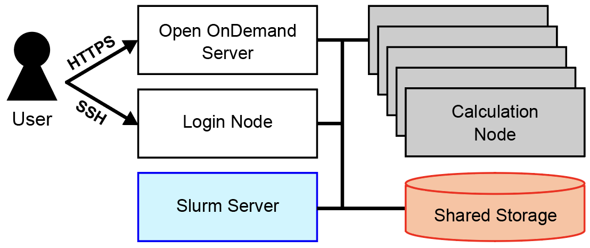

# ログイン方法

本システムにログインする方法として、<span class="text-marker">WebブラウザからHTTPSでOpen OnDemandサーバに接続する方法</span>と<span class="text-marker">端末ソフトウェアからSSHでログインノードに接続する方法</span>を提供しています。どちらかの方法でログインした後、[Slurmジョブスケジューラ](https://slurm.schedmd.com/slurm.html){ target="_blank" rel="noopener" }を介して計算ノードにジョブを投入します。データは共用ストレージ上に配置して利用します。



## Open OnDemand

Open OnDemandは、Webブラウザからスーパーコンピュータを利用できるWebポータルです。Open OnDemandには次のリンクからログインしてください。

[Open OnDemand](https://ondemand.rikyu.r-ccs.riken.jp){ .md-button .md-button--primary .action-button target="_blank" rel="noopener" }

詳しくは[Open OnDemandの使い方](ood.md)を参照してください。

## 端末ソフトウェア

### 鍵ペア（秘密鍵と公開鍵）の作成

!!! note

    鍵ペアを未生成の方のみ、本節を参考にして鍵ペアを生成してください。

端末ソフトウェアからSSHで接続する前に、秘密鍵と公開鍵の鍵ペアを作成します。生成する鍵ペアの種類は、次のいずれかを推奨します。

- Ed25519
- ECDSA（NIST P-521）
- RSA（鍵長2048 bit以上）

鍵ペアの生成方法として、ターミナルから行う方法を説明します。

- Windowsの場合は、PowerShellを起動してください。
- macOSの場合は、Terminal（アプリケーション &#x25BB; ユーティリティ &#x25BB; ターミナル）を起動してください。
- Linuxの場合は、端末エミュレータを起動してください。

Ed25519の鍵ペアを生成する`ssh-keygen`コマンドの例を次に示します（Windowsの場合は`ssh-keygen.exe`コマンドになります）。コマンド実行後に、ホームディレクトリ配下の`.ssh`ディレクトリに秘密鍵（`id_ed25519`）と公開鍵（`id_ed25519.pub`）の鍵ペアが作成されます。

```bash
ssh-keygen -t ed25519
```

出力例：

```text
Generating public/private ed25519 key pair.
Enter file in which to save the key (/home/username/.ssh/id_ed25519):
Enter passphrase (empty for no passphrase):  # パスフレーズを入力
Enter same passphrase again:                 # もう一度同じパスフレーズを入力
Your identification has been saved in /home/username/.ssh/id_ed25519.
Your public key has been saved in /home/username/.ssh/id_ed25519.pub.
The key fingerprint is:
SHA256:dlah2Qrf131ccOS5Fs/IFbrkd8LLWMHxPI393AMagag username@hostname
The key's randomart image is:
+--[ED25519 256]--+
|        . ... ooo|
|       . . +.o.X+|
|      . . o.o+++O|
|     E   o +=ooOX|
|        S =..oB=%|
|       . o   =oo+|
|            . o  |
|                 |
|                 |
+----[SHA256]-----+
```

!!! warning

    パスフレーズは必ず設定してください。他人が推測しにくい文字列（15文字以上を推奨）にしてください。

### SSH公開鍵の登録

SSH公開鍵をOpen OnDemandから本システムに登録します。Open OnDemandには次のリンクからログインしてください。

[Open OnDemand](https://ondemand.rikyu.r-ccs.riken.jp){ .md-button .md-button--primary .action-button target="_blank" rel="noopener" }

<span class="text-marker">SSH Public Key</span>を起動してください。次の画面が表示されますので、<span class="text-marker">Add a Public Key</span>のテキストエリアにご自身のSSH公開鍵を入力し、<span class="text-marker">Add</span>ボタンをクリックしてください。登録が成功すると、<span class="text-marker">Registered Public Keys</span>に登録情報が表示されます。


公開鍵の登録後、端末ソフトウェアから次のコマンドでSSHログインできます。`USERNAME`は自分のユーザ名に置き換えてください。

```bash
ssh USERNAME@login.rikyu.r-ccs.riken.jp
```

コマンドラインによるジョブの投入方法などについては、[Slurmの使い方](slurm.md)を参照してください。
