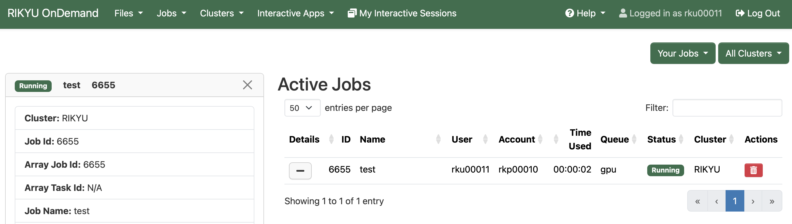
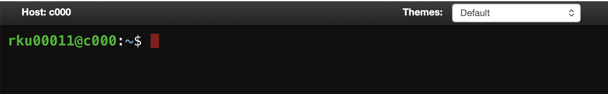
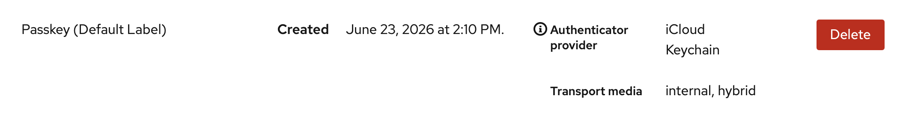
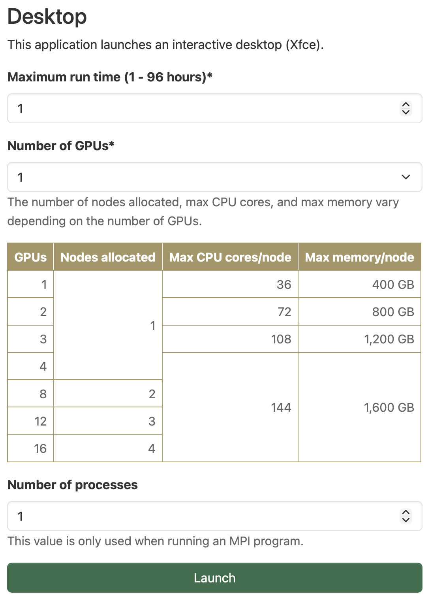

# Open OnDemandの使い方

Open OnDemandは、Webブラウザからスーパーコンピュータを利用できるWebポータルです。Open OnDemandへは以下のリンクからログインしてください。

[Open OnDemand](https://ondemand.rikyu.r-ccs.riken.jp){ .md-button .md-button--primary .action-button target="_blank" rel="noopener" }

Open OnDemandでは、次の機能を利用できます。

* ファイルの送受信・編集
* ジョブの投入と管理
* Webターミナルの利用
* 対話アプリケーション（リモートデスクトップなど）の実行

!!! note
 
    Open OnDemandは、Google Chrome、Mozilla Firefox、Microsoft Edgeなどの主要なWebブラウザに対応していますが、Internet Explorer 11は対応していません。Chromeは、リモートデスクトップなどで文字列のコピー&ペースト機能をネイティブにサポートしているため、Chromeの利用を推奨します。

下図は「理究」のOpen OnDemandのダッシュボードです。

画面上部にあるメニューバーの項目は下記の通りです。

|              項目              |                          意味                          |
| ------------------------------ | ------------------------------------------------------ |
| Files                          | ファイルの送受信・編集                                 |
| Jobs                           | ジョブの投入と管理                                     |
| Clusters                       | クラスタに対する操作（Webターミナルなど）              |
| Interactive Apps               | 対話アプリケーション（リモートデスクトップなど）の実行 |
| My Interactive Sessions        | 対話アプリケーションのセッション情報の一覧             |
| Help &rarr; Restart Web Server | Open OnDemandの再起動                                  |
| Log Out                        | Open OnDemandからのログアウト                          |

!!! note

    ブラウザの幅が狭くなると、アイコン表示に変わるものもあります。

## ファイルの送受信・編集

|      名前      |         説明           |
| -------------- | ---------------------- |
| Home Directory | ファイルの送受信・編集 |

### Home Directory
ファイルの送受信・編集などを行えます。送受信可能な最大サイズは10GBです。

Home Directoryの各機能は下記の通りです。個別のファイルやディレクトリに対する操作は「3点＋下三角」のメニューから行えます。

|    ツールバー    |              説明            |
| ---------------- | ---------------------------- |
| Open in Terminal | Webターミナルの起動          |
| Refresh          | ページを再描画               |
| New File         | 新規ファイル作成             |
| New Directory    | 新規ディレクトリ作成         |
| Upload           | ファイルのアップロード       |
| Download         | ファイルのダウンロード       |
| Copy/Move        | ファイルのコピー、移動       |
| Delete           | ディレクトリやファイルの削除 |

|     パスバー    |                説明                |
| --------------- | ---------------------------------- |
| &uarr;          | 1つ上のディレクトリに移動          |
| Change directry | ディレクトリの移動                 |
| Copy path       | 現在のパスをクリップボードにコピー |

|  表示オプション |                説明                  |
| --------------- | ------------------------------------ |
| Show Owner/Mode | 所有者とパーミッションの表示         |
| Show Dotfiles   | ドットファイル（隠しファイル）の表示 |
| Filter          | ファイル名による絞り込み             |

## ジョブの投入と管理

|           名前          |            説明          |
| ----------------------- | ------------------------ |
| Active Jobs             | ジョブのモニタリング     |
| Open Composer（準備中） | バッチジョブの作成と投入 |

### Active Jobs

ジョブの情報の閲覧や削除ができます。IDの列の左側のボタンをクリックすると、ジョブの詳細情報を表示できます。Actionsの列のボタンをクリックすると、ジョブを削除できます。

### Open Composer

（準備中）

## クラスタに対する操作

|           名前           |            説明          |
| ------------------------ | -------------------------|
| RIKYU Shell Access       | Webターミナル            |
| SSH Public Key           | SSH公開鍵の登録          |
| Delete Passkey（準備中） | パスキーの削除           |
| System Status（準備中）  | クラスタの利用状況の確認 |

### RIKYU Shell Access

WebブラウザからログインノードにSSHアクセスし、コマンドラインインタフェースを用いた操作ができます。

### SSH Public Key

[SSH公開鍵の登録](https://docs.r-ccs.riken.jp/rikyu/ja/login/#ssh)を参照してください。

### Delete Passkey

（準備中）

<!-- 登録済のPasskeyを削除することができます。「Delete」ボタンをクリックしてください。-->
<!--   -->

### System Status

（準備中）

## 対話アプリケーション

対話アプリケーションは、計算ノード上で実行するアプリケーションを、ユーザが対話的に操作するための機能です。

|                     名称                                  |                               説明                                  |
| --------------------------------------------------------- | ------------------------------------------------------------------- |
| Desktop ([Xfce](https://www.xfce.org/))                   | X Window System上で動作する軽量デスクトップ環境                     |
| [JupyterLab](https://jupyter.org/)（調整中）              | Webブラウザ上で動作するプログラムの対話型実行環境                   |
| Terminal ([ttyd](https://github.com/OpenOnDemandJP/ttyd)) | ターミナルセッションをウェブブラウザから操作するためのツール        |
| [VSCode](https://code.visualstudio.com/)                  | [Microsoft](https://www.microsoft.com/)が開発しているコードエディタ |
| NVIDIA Profiler                                           | [NVIDIA Nsight Compute](https://developer.nvidia.com/nsight-compute)と[NVIDIA Nsight Systems](https://developer.nvidia.com/nsight-systems) |
| [Gnuplot](http://www.gnuplot.info/)                       | コマンドライン駆動型グラフ作成プログラム                            |
| [OVITO](https://www.ovito.org)                            | 粒子シミュレーションなどの大規模データの可視化・解析プログラム      |
| [ParaView](https://www.paraview.org/)                     | 科学技術データ可視化プログラム                                      |
| [PyMOL](https://www.pymol.org/)                           | 生体高分子の立体構造などび可視化・解析プログラム                    |

例として、Desktopの利用方法を説明します。メニューバーのInteractive AppsからDesktopをクリックすると、計算リソースなどを入力するためのWebフォームが表示されます。入力後にLaunchをクリックすると、「理究」にジョブが投入されます。

ジョブ投入直後は、画面右上にQueuedと表示されます。これは、ジョブが実行待ちであることを表しています。

ジョブが計算ノードで起動するとRunningという表示に変わり、Launch Desktopボタンが表示されます。Compression（圧縮レベル）とImage Quality（画質レベル）に必要に応じて値を設定し、Launch Desktopボタンをクリックすると、DesktopがWebブラウザに表示されます。

!!! tip

    View Only (Share-able Link)ボタンをクリックすると、ミラーリングされたDesktopが新しいタブで開きます。ミラーリングされた画面は操作できません。このタブのURLをメールなどで送信することで、「理究」にアカウントを持っているユーザ間でのみ画面共有できます。

Desktopを終了させたい場合は、以下のいずれかの手順で終了してください。Webブラウザを閉じるだけでは終了しないことに注意してください。

* Running画面のDeleteボタンをクリックする。
* メニューバーのMy Interactive Sessionsをクリックし、該当のジョブのDeleteボタンをクリックする。
* Desktopの左上のApplicationsからLog Outをクリックする。
