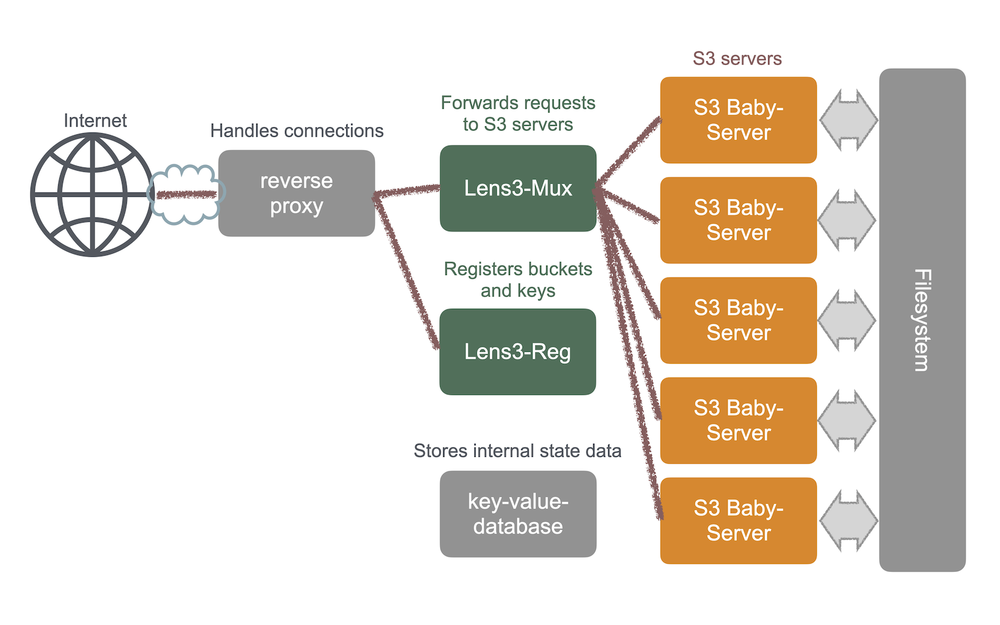

# S3 ファイルシステムの使い方

Rikyu ではホームディレクトリのファイルを Amazon AWS S3 プロトコルで共有できます。AWS S3 サービスは登録されたバケットへのアクセスで起動されます。ユーザーはあらかじめ共有するディレクトリを登録し、バケットとアクセスキーを作成する必要があります。

## サービスの概要 { #service }

このサービス Lenticularis-S3 （略称 Lens3）は、2つのオープンソースソフトウェア Lens3 + Baby-server で構成されています。Lens3 は複数のサーバーに対して単一のアクセスポイントを提供するマルチプレクサです。Baby-server は AWS S3 サーバーです。Lens3 はアクセス・リクエストをバケットの所有者に応じてサーバーの1つに転送します。



Lens3 はバケットの一覧やバケットの作成などのバケット操作を提供しません。Lens3 の動作は、登録されたバケットに対応してリクエストを転送します。そのため、まずバケットが登録されている必要があります。

バケットの作成は事前に実行する必要があります。Web-UI を使用してバケットを作成します。Lens3 の用語では「プール」がバケットを作成するディレクトリを指します。ユーザーはまずプールを作成し、その中にバケットを作成することになります。

## バケットの登録 { #buckets }

Lens3 Registrar は以下の URL でアクセスできます。これはプールを登録し、バケットとアクセスキーを作成するサービスです。

[https://lens3.rikyu.r-ccs.riken.jp/lens3.sts/](https://lens3.rikyu.r-ccs.riken.jp/lens3.sts/)

バケット作成手順については github.com の Lens3 のガイドを参照してください。バケット名の空間はすべてのユーザーで共有されます。バケット名はその中で一意である必要があります。短い一般的な名前は避けてください。

[https://github.com/RIKEN-RCCS/lens3/blob/main/v2/doc/user-guide.md](https://github.com/RIKEN-RCCS/lens3/blob/main/v2/doc/user-guide.md)

## AWS CLI によるバケットアクセス { #awscli }

S3 サービスのアクセスポイントは以下の通りです:

    https://lens3.rikyu.r-ccs.riken.jp

AWS S3 クライアント・ソフトウェアは好みのものを選択してください。AWS CLI が代表的です。ここでは AWS CLI を利用します。

### AWS CLI のインストール

AWS CLI のインストール手順は以下のページにあります。

[Installing or updating to the latest version of the AWS CLI](https://docs.aws.amazon.com/cli/latest/userguide/getting-started-install.html)

設定ファイル "~/.aws/config" に以下の行を設定してください。認証情報は Web-UI で作成およびコピーできます。通常は認証情報のペア（access key）の行だけで十分です。認証情報は別のファイル "~/.aws/credentials" に設定することもできます。

    [default]
    s3 =
        signature_version = s3v4
        addressing_style = path
    ec2_metadata_disabled = true
    endpoint_url = https://lens3.rikyu.r-ccs.riken.jp
    aws_access_key_id = WoRKvRhrdaMNSlkZcJCB
    aws_secret_access_key = DzZv57R8wBIuVZdtAkE1uK1HoebLPMzKM6obA4IDqOhaLIBf

### S3 操作 -- ファイルの一覧表示

まず、以下のコマンドを試してください:

```bash
aws s3 ls s3://some-bucket-name/
```

*some-bucket-name* は実際のバケット名に置き換えてください。

オプションで `aws` コマンドに `--endpoint-url=https://lens3.rikyu.r-ccs.riken.jp` を指定することも可能です。これは "~/.aws/config" の "endpoint_url" を置き換えます。

### S3 操作 -- ファイルのアップロード

次に、このコマンドを試してください:

```bash
aws s3 cp sample.txt s3://some-bucket-name/
```

### S3 操作 -- ファイルのダウンロード

別のコマンドを試してください:

```bash
aws s3 cp s3://some-bucket-name/sample.txt
```

!!! note

    アクセスキーには有効期限があります。アクセスキーの有効期限は 180 日に制限されています（現在の設定）。これより長い有効期間でキーを作成しようとすると失敗します。

    サービスは同時に 30 サーバーに限定されています（同時にアクセスされるプール数で制限されています）。サービスが混雑するようでしたらこの制限を緩和します。

## ソフトウェアコンポーネント { #software }

- Lens3: エンドポイント・マルチプレクサ
    - https://github.com/RIKEN-RCCS/lens3
- S3 Baby-server: AWS S3 サーバー
    - https://github.com/RIKEN-RCCS/s3-baby-server
