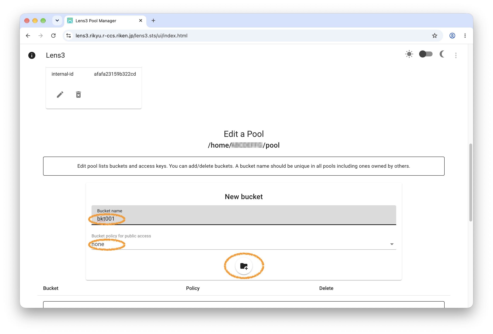
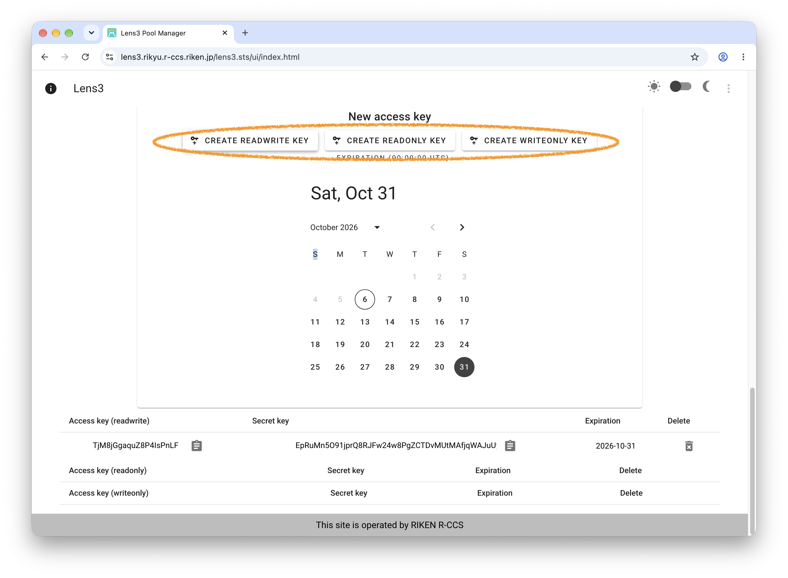

# S3 ファイルシステムの使い方

## サービスの概要 { #service }

Rikyuの AWS S3 サービスでは、ホームディレクトリ内のファイルを
Amazon AWS S3 プロトコルで共有できます。このサービス
Lenticularis-S3 (Lens3) は、Lens3 と Baby-server という
2つのオープンソースソフトウェアで構成されています。

Lens3 には、バケットの一覧表示や作成といったバケット操作の機能はありません。
S3 サービスは、登録済みのバケットにアクセスしたときに起動するためです。
そのため、バケットは事前に作成しておく必要があります。
バケットの作成には Registrar Web-UI を使います。

Lens3 の用語では、バケットを作成するファイルシステム上のディレクトリを
*プール* (pool)と呼びます。ユーザーはまずプールを作成し、
その中にバケットを作成します。

## バケットの登録とアクセスキーの生成 { #buckets }

Lens3 Registrar には次のURLからアクセスできます。ここでプールの登録、
バケットの登録、およびアクセスキーの作成を行います。

[https://lens3.rikyu.r-ccs.riken.jp/lens3.sts/](https://lens3.rikyu.r-ccs.riken.jp/lens3.sts/)

以下では、Lens3 の使い方を順を追って説明します。
最初の手順はプールの作成です。

### プールの作成

Registrar Web-UI にアクセスすると、最初に *Manage Pools* セクションが表示されます。
プールはバケットを格納するディレクトリです。アクセスキーもプールに
関連付けられます。

ディレクトリをフルパスで入力し、unix グループを選択して、
作成ボタン(プラスアイコン)をクリックします。ディレクトリは、
そのユーザー＋グループの組で書き込み可能である必要があります。


### プールの選択

*List Pools* セクションには、既存のプールが一覧表示されます。
これはスライダー形式のリストです。作成したプールの *backend-state* を確認してください。
*ready* と表示されていれば正常です。プールが inoperable 状態の場合は使用できません。
(多くの場合、ディレクトリが書き込み可能でないことが原因です)。

編集ボタン(鉛筆アイコン)をクリックするとプールが選択され、
Edit a Pool セクションが開きます。削除ボタン(ゴミ箱アイコン)を
クリックするとプールを削除します。


### バケットの作成

*Edit a Pool* セクションには、互いに独立した2つのサブセクションがあります。
1つはバケット用、もう1つはアクセスキー用です。

バケットには、公開アクセスの権限を指定するバケットポリシーがあります:
**none**、**upload**、**download**、**public**。
none ポリシーのバケットには、アクセスキーを使った場合のみアクセスできます。

バケット名はグローバルで、全ユーザーで共有されます。
短くありふれた名前は避けてください。



### アクセスキーの生成

アクセスキーにはキーポリシーがあります: **readwrite**、**readonly**、
**writeonly**。バケットへのアクセスは、これらのポリシーによって制限されます。
有効期限には未来の日付を指定してください。有効期限の実体は秒単位の時刻ですが、
UI では UTC 午前0時の日付単位でのみ扱います。



### Lens3 ユーザーガイド

github.com の Lens3 のページに、Lens3 の詳細を説明したユーザーガイドがあります。
こちらも参照してください。

[https://github.com/RIKEN-RCCS/lens3/blob/main/v2/doc/user-guide.md](https://github.com/RIKEN-RCCS/lens3/blob/main/v2/doc/user-guide.md)

## AWS CLI によるバケットへのアクセス { #awscli }

S3 サービスのアクセスポイント (`endpoint_url`) は次のとおりです:

    https://lens3.rikyu.r-ccs.riken.jp

AWS S3 のクライアントソフトウェアは数多くあるので、お好みのものを選んでください。
AWS CLI はよく使われるクライアントの1つです。以下では AWS CLI を使って説明します。

### AWS CLI のインストール

AWS CLI のインストール手順は次のページにあります。

[AWS CLI の最新バージョンのインストールまたは更新](https://docs.aws.amazon.com/ja_jp/cli/latest/userguide/getting-started-install.html)

設定ファイル "~/.aws/config" には、次のような行を記述できます。
認証情報は Web-UI で作成してコピーできます。通常は、認証情報(アクセスキー)の
組の行だけで十分です。なお、認証情報は別ファイル "~/.aws/credentials"
に保存することもできます。

    [default]
    s3 =
        signature_version = s3v4
        addressing_style = path
    ec2_metadata_disabled = true
    endpoint_url = https://lens3.rikyu.r-ccs.riken.jp
    aws_access_key_id = XXXXXXXXXXXXXXXXXXXX
    aws_secret_access_key = XXXXXXXXXXXXXXXXXXXXXXXXXXXXXXXXXXXXXXXXXXXXXXXX

### S3 操作 -- ファイルの一覧表示

簡単なコマンドを試してみましょう:

```bash
aws s3 ls s3://some-bucket-name/
```

*some-bucket-name* は、いつものように実際のバケット名に置き換えてください。

`aws` コマンドには、オプションとして
`--endpoint-url=https://lens3.rikyu.r-ccs.riken.jp` を指定することもできます。
これは "~/.aws/config" の "endpoint_url" の値より優先されます。

### S3 操作 -- ファイルのアップロード

次に、このコマンドを試してみましょう:

```bash
aws s3 cp sample.txt s3://some-bucket-name/
```

### S3 操作 -- ファイルのダウンロード

あるいは、別のコマンドを試してみましょう:

```bash
aws s3 cp s3://some-bucket-name/sample.txt .
```

!!! note

    アクセスキーには有効期限があります。現在の設定では、アクセスキーの
    有効期間は最長180日です。これより長い有効期間のキーを作成しようとすると
    失敗します。

    同時に起動できるサーバー(同時にアクセスされるプール)は30個までに
    制限されています。サービスの利用が増えてきたら、この制限を緩和する予定です。

## ソフトウェア構成 { #software }

- Lens3: エンドポイントマルチプレクサ
    - [https://github.com/RIKEN-RCCS/lens3](https://github.com/RIKEN-RCCS/lens3)
- S3 Baby-server: 小規模 AWS S3 サーバー
    - [https://github.com/RIKEN-RCCS/s3-baby-server](https://github.com/RIKEN-RCCS/s3-baby-server)
