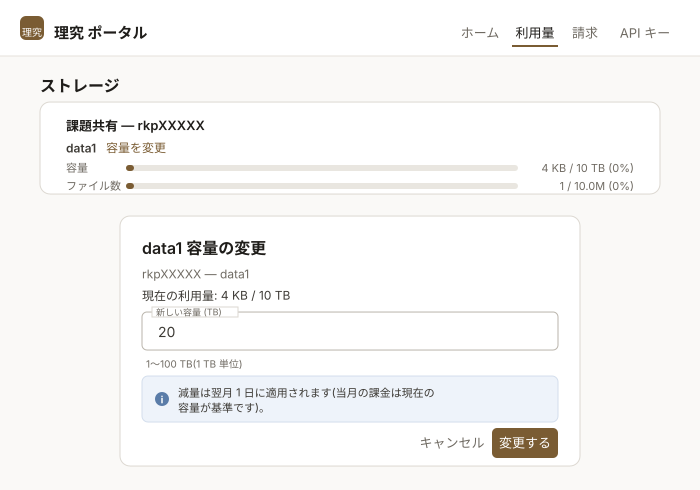

# ストレージ

本システムのストレージ領域は、<span class="text-marker">ホーム領域</span>、<span class="text-marker">グループ領域</span>、<span class="text-marker">スクラッチ領域</span>の3つに分けられます。本ページでは、各領域の特徴を説明します。用途に応じて使い分けてください。

## ホーム領域

各ユーザは50 GBのホーム領域（`/home/USER`）を持ちます。`USER`はユーザ名です。ホーム領域を読み書きできるのは、その領域を持つユーザ本人だけです。ホーム領域は、ユーザごとの設定ファイルや小規模な作業ファイルの保存に適しています。

コマンドラインでホーム領域の利用状況を確認するには、以下のコマンドを実行してください。

```bash
lfs quota -h -p `lfs project -d $HOME | awk '{print $1}'` /home
```

出力例：

```text
Disk quotas for prj 100010 (pid 100010):
Filesystem    used   bquota  blimit  bgrace   files   iquota  ilimit  igrace
     /home   2.42G       0k     50G       -     511        0 1000000       -
```

`used`は使用済み容量、`blimit`は容量の上限、`files`は使用中のファイル数、`ilimit`はファイル数の上限です。

## グループ領域

各グループは1 TBのグループ領域（`/data1/GROUP`）を持ちます。`GROUP`はグループ名です。グループ領域は、同じグループのメンバが読み書きできます。グループ領域は、大規模な作業ファイルや同じグループのメンバで共同利用するデータの保存に適しています。

コマンドラインでグループ領域の利用状況を確認するには、以下のコマンドを実行してください（`GROUP`にはグループ名を指定してください）。

```bash
lfs quota -h -p `lfs project -d /data1/GROUP | awk '{print $1}'` /data1
```

出力例：

```text
Disk quotas for prj 200013 (pid 200013):
Filesystem    used   bquota  blimit  bgrace   files   iquota  ilimit  igrace
    /data1      4k       0k      1T       -       1        0 10000000       -
```

`used`は使用済み容量、`blimit`は容量の上限、`files`は使用中のファイル数、`ilimit`はファイル数の上限です。

コマンドラインでグループ名を知りたい場合は、`id`コマンドを実行し、`groups=...`に表示される`rkp`で始まる文字列を確認してください。実行例は次のとおりです。1人のユーザは複数のグループを持つことがあります。

```bash
rku00011@c000:~$ id
uid=100010(rku00011) gid=200000(rkuser) groups=200000(rkuser),200013(rkp00010)
```

## スクラッチ領域

各計算ノードは、ローカルSSDで構成されたスクラッチ領域（`/tmp`）を持ちます。1 GPUごとに1.5 TBを利用できます。スクラッチ領域を読み書きできるのは、ジョブを実行しているユーザ本人だけです。スクラッチ領域は、計算中の中間結果などを高速なローカルSSD上で扱いたい場合に適しています。

スクラッチ領域上のファイルはジョブ終了時にすべて削除されるため、保存が必要な結果はジョブ終了前にホーム領域またはグループ領域にコピーしてください。

## 各領域の比較

ホーム領域とグループ領域は共用ストレージ上にあるため、計算ノードとログインノードのどちらからでも利用できます。また、複数の計算ノード間でデータを共有できます。スクラッチ領域はジョブが実行されている計算ノード上の一時領域であり、そのノード上で実行される処理からのみ利用できます。ホーム領域とグループ領域のファイルシステムはLustreで、スクラッチ領域のファイルシステムはxfsです。読み書きできるユーザは領域によって異なり、ホーム領域とスクラッチ領域はユーザ本人のみ、グループ領域は同じグループのメンバです。

<div class="spec-table">
<table>
  <tbody>
    <tr>
      <th>名称</th>
      <th>マウント先</th>
      <th>容量</th>
      <th>ログインノードからの利用と<br>複数ノード間の共有</th>
      <th>ファイルシステム</th>
      <th>読み書きできるユーザ</th>
    </tr>
    <tr>
      <td>ホーム領域</td>
      <td><code>/home/USER</code></td>
      <td>50 GB</td>
      <td rowspan="2">可能</td>
      <td rowspan="2">Lustre</td>
      <td>本人のみ</td>
    </tr>
    <tr>
      <td>グループ領域</td>
      <td><code>/data1/GROUP</code></td>
      <td>1 TB/グループ</td>
      <td>同じグループ</td>
    </tr>
    <tr>
      <td>スクラッチ領域</td>
      <td><code>/tmp</code></td>
      <td>1.5 TB/GPU</td>
      <td>不可能</td>
      <td>xfs</td>
      <td>本人のみ</td>
    </tr>
  </tbody>
</table>
</div>

ホーム領域には高速ストレージ2 PB（SSD）を、グループ領域には大容量ストレージ10 PB（HDD）を利用しています。そのため、ホーム領域とグループ領域では性能特性が異なることに注意してください。

## 容量の変更

### グループ領域

グループ領域の容量は、課題代表者（PI）または副代表者（SubPI）が理究ポータルで変更できます。1 TB単位で、100 TBまで設定できます。

[理究ポータル](https://portal.rikyu.r-ccs.riken.jp/ja/usage/){ .md-button .md-button--primary .action-button target="_blank" rel="noopener" }

ポータルにログインし、画面上部の<span class="text-marker">利用量</span>を選択します。<span class="text-marker">ストレージ</span>にある課題の<span class="text-marker">容量を変更</span>をクリックし、<span class="text-marker">新しい容量 (TB)</span>を入力して<span class="text-marker">変更する</span>をクリックします。



容量を増やした場合、新しい設定が反映されるまで5〜10分程度かかります。容量を減らした場合は、翌月1日に反映されます。減量の予約は課題ごとに1件で、再度設定すると上書きされます。現在の容量と同じ値を設定すると、予約は取り消されます。

!!! note

    容量を変更できるのはPIまたはSubPIのみです。課題のメンバは、現在の使用量と容量を参照できます。

!!! note

    ファイル数（inode）の上限は、ポータルからは変更できません。変更が必要な場合はチケットで依頼してください。

100 TBを超える容量が必要な場合は、PIまたはSubPIが以下のリンクからチケットで申請してください。

[チケット作成](https://support.r-ccs.riken.jp/hc/ja/requests/new){ .md-button .md-button--primary .action-button target="_blank" rel="noopener" }

### ホーム領域

ホーム領域の容量は変更できません。大きなデータはグループ領域に保存してください。

!!! note

    追加容量に応じた課金が発生する予定ですが、早期アクセスフェーズ2の期間中は課金は発生しません。料金は現在調整中です。
